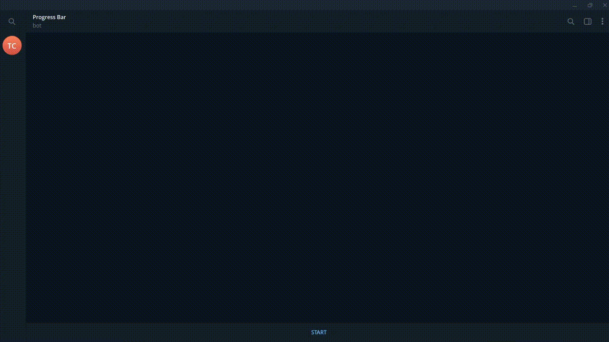

# Progresser — Прогресс бар для постов в вашем ТГ канале

Телеграм‑бот, который планирует посты в канал и показывает живой прогресс‑бар до момента публикации. 




## Ключевые возможности

- ⏳ Живой прогресс‑бар прямо в канале 
- 📝 Текстовый пост или 📷 фото с подписью
- ⏱ Пресеты длительности: 1/5/10 минут либо свой вариант
- ♻️ Возобновление после рестарта: незавершённые бары автоматически продолжаются (SQLite)
- ❌ Отмена любой задачи через `/cancel` с отображением прогресса и оставшегося времени
- 🔐 `/check_add` — реальная проверка возможностей (отправка/редактирование/удаление) с понятным отчётом
- 🌐 Локализация: русский (по умолчанию) и английский (`--language en`)
- 🐳 Готово к продакшен‑развёртыванию: Docker + docker‑compose (авторестарт, сохранение БД)

## Стек

- Python 3.10+, `python-telegram-bot` v22
- `python-dotenv`
- SQLite (хранение задач)
- Docker, Docker Compose

## Как это работает

1) Отправьте `/run` и пришлите текст и/или фото.
2) Выберите длительность обратного отсчёта.
3) Бот опубликует сообщение‑прогресс‑бар и будет его обновлять.
4) По завершении прогресса бот удалит бар и опубликует ваш контент.

## Быстрый старт

### Вариант A — Docker Compose (рекомендуется)

1. Создайте файл `.env` в корне проекта:
```
BOT_TOKEN="ВАШ_ТОКЕН_БОТА"
CHANNEL_ID="ID_ВАШЕГО_КАНАЛА"
```

2. Запуск:
```bash
docker compose up -d --build
```

3. Логи:
```bash
docker compose logs -f
```

4. Остановка:
```bash
docker compose down
```

Заметки:
- База данных сохраняется благодаря монтированию `./jobs.db` → `/app/jobs.db`.
- Сервис использует `restart: unless-stopped` и автоматически перезапускается при сбоях.

### Вариант B — Docker

```bash
docker build -t progress-bar-bot .
docker run -d --env-file .env progress-bar-bot
```

Или передайте переменные напрямую:
```bash
docker run -d \
  -e BOT_TOKEN="ВАШ_ТОКЕН_БОТА" \
  -e CHANNEL_ID="ID_ВАШЕГО_КАНАЛА" \
  progress-bar-bot
```

### Вариант C — Локально

```bash
pip install -r requirements.txt
# создайте .env с переменными ниже
python bot.py
```

## Переменные окружения

- `BOT_TOKEN` — токен бота от @BotFather
- `CHANNEL_ID` — ID канала, в который бот публикует (например, `-100...`)

Подсказка: если не знаете ID канала — отправьте ваш канал боту @username_to_id_bot, он вернёт числовой ID (обычно начинается с `-100`).

Пример `.env`:
```env
BOT_TOKEN=8260xxxxxxxxxxxxxxxxxxxxxxxxxxxx
CHANNEL_ID=-1002033013466
```

## Команды бота

- `/start` — краткая справка
- `/run` — запланировать публикацию с прогресс‑баром
- `/cancel` — список/отмена активных задач
- `/check_add` — проверка прав в канале (отправка/редактирование/удаление)

## Язык интерфейса

По умолчанию — русский. Переключить на английский:
```bash
python bot.py --language en
```

Через Docker:
```bash
docker run --rm -it --env-file .env progress-bar-bot python bot.py --language en
```

Через Docker Compose (одноразовый запуск):
```bash
docker compose run --rm bot python bot.py --language en
```

## Отмена и возобновление

- При отмене задача помечается как `cancelled`, прогресс‑цикл проверяет статус и корректно завершает работу без дальнейших попыток редактирования удалённого сообщения.
- При запуске бот возобновляет все задачи в статусе `active`.

## Технические детали

- Таблица SQLite `jobs`: `id, chat_id, message_id, post_text, media(json), duration, start_time, status`.
- Прогресс‑обновления батчатся по интервалу, чтобы не упираться в лимиты редактирования.
- `/check_add` выполняет реальные тесты: отправка → редактирование → удаление (удаление — опционально) и выдаёт недвусмысленный отчёт о готовности.
- В docker‑compose включён `restart: unless-stopped` и биндинг БД для сохранности.

## Лицензия

MIT — см. файл `LICENSE`.
